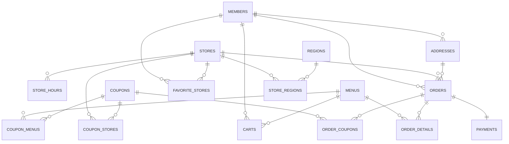

# 概念設計図（エンティティのみ）

## エンティティ説明

### コアエンティティ

- **MEMBERS**: アプリ利用者（会員）
- **STORES**: マクドナルド店舗
- **MENUS**: 提供商品・メニュー
- **ORDERS**: 注文情報
- **ORDER_DETAILS**: 注文詳細（商品ごと）

### 支援エンティティ

- **ADDRESSES**: 配送先住所
- **CARTS**: ショッピングカート
- **PAYMENTS**: 決済情報
- **COUPONS**: クーポン・割引

### 関連エンティティ

- **STORE_HOURS**: 店舗営業時間
- **REGIONS**: 配送対応地域
- **FAVORITE_STORES**: お気に入り店舗

### 中間エンティティ

- **COUPON_STORES**: クーポン適用店舗
- **COUPON_MENUS**: クーポン適用商品
- **ORDER_COUPONS**: 注文で使用されたクーポン
- **STORE_REGIONS**: 店舗配送対応地域
