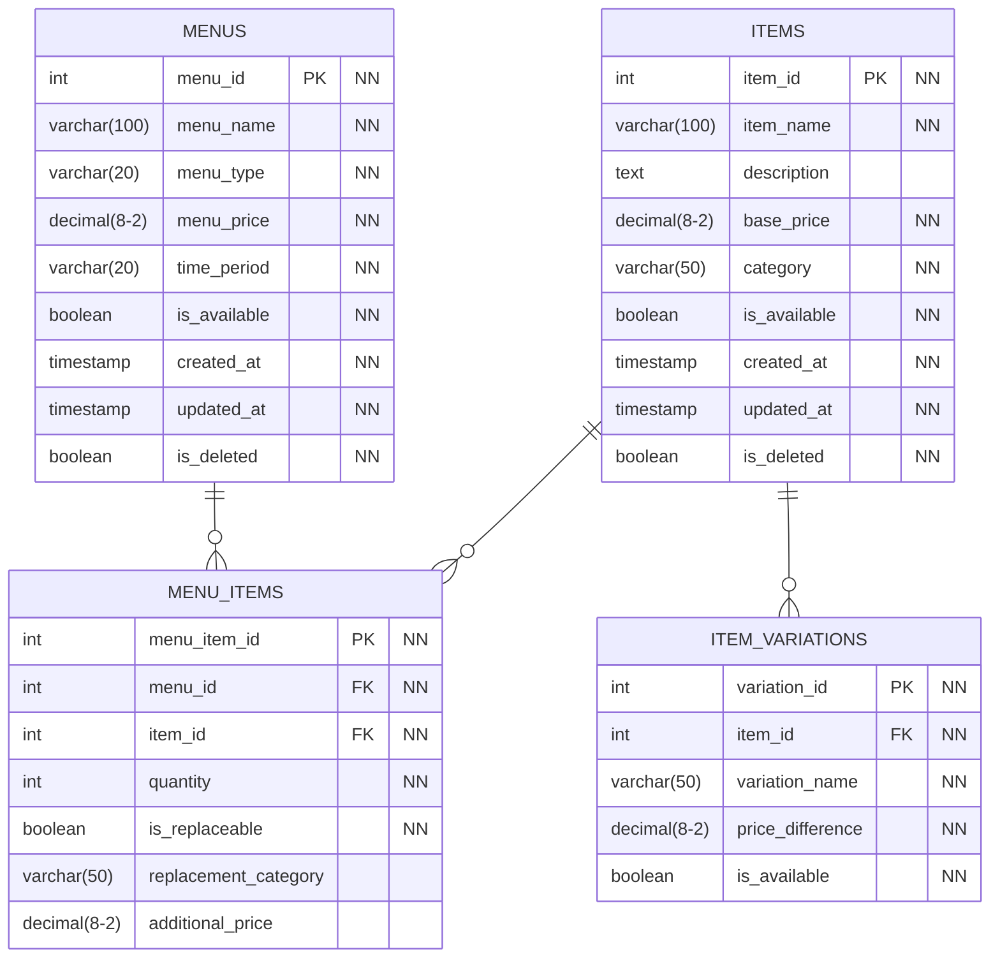

# メニュー構造の分析と設計改善案

## 現在の設計の問題点

### 平坦な構造の課題

現在の MENUS テーブルでは、すべてのメニューを同じレベルで管理しています：

```md
MENUS テーブル（現在）
- ビッグマック（390円）
- ビッグマックセット（690円）
- ポテトM（280円）
- コーラM（150円）
```

### 問題点

1. **セットと単品の関係が不明確**

   - ビッグマックセットがどの単品の組み合わせかわからない
   - セット割引の計算ロジックが複雑

2. **カスタマイズ対応の困難**

   - セットのドリンクをコーラからオレンジジュースに変更
   - ポテトのサイズを M から L に変更
   - これらの対応が現在の構造では困難

3. **在庫管理の複雑さ**

   - 単品とセットで重複する商品の在庫管理
   - 実際の消費は単品レベルで発生

4. **価格管理の複雑さ**
   - セット価格と単品価格の整合性管理
   - 単品価格変更時のセット価格への影響

## 改善案 1: 階層構造設計

### 新しいテーブル構造



### 具体例

**ITEMS テーブル（単品商品）**

```
item_id | item_name | base_price | category
1       | ビッグマック | 390       | バーガー
2       | ポテト     | 280       | サイド
3       | コーラ     | 150       | ドリンク
4       | オレンジ   | 150       | ドリンク
```

**MENUS テーブル（メニュー定義）**

```
menu_id | menu_name        | menu_type | menu_price
1       | ビッグマック     | 単品      | 390
2       | ビッグマックセット| セット    | 690
```

**MENU_ITEMS テーブル（メニュー構成）**

```
menu_id | item_id | quantity | is_replaceable | replacement_category
1       | 1       | 1        | false         | null
2       | 1       | 1        | false         | null
2       | 2       | 1        | true          | サイド
2       | 3       | 1        | true          | ドリンク
```

**ITEM_VARIATIONS テーブル（商品バリエーション）**

```
item_id | variation_name | price_difference
2       | Sサイズ       | -50
2       | Lサイズ       | +50
3       | Sサイズ       | -30
3       | Lサイズ       | +30
```

## 改善案 2: ハイブリッド構造設計

### 現在の構造を活かした改善

既存の MENUS テーブルを基本とし、必要な情報を追加する案：

```sql
-- 既存のMENUSテーブルに列を追加
ALTER TABLE MENUS ADD COLUMN menu_type VARCHAR(20) NOT NULL; -- '単品', 'セット', 'ハッピーセット'
ALTER TABLE MENUS ADD COLUMN parent_menu_id INT; -- セットの場合、ベース商品のID

-- 新しいテーブルを追加
CREATE TABLE MENU_COMPONENTS (
    component_id INT PRIMARY KEY,
    menu_id INT NOT NULL,
    component_menu_id INT NOT NULL,
    quantity INT NOT NULL DEFAULT 1,
    is_optional BOOLEAN NOT NULL DEFAULT false,
    is_replaceable BOOLEAN NOT NULL DEFAULT false,
    replacement_category VARCHAR(50),
    additional_price DECIMAL(8,2) DEFAULT 0
);
```

## 各アプローチの比較

### 改善案 1（階層構造）のメリット

1. **明確な構造**: 単品とセットの関係が明確
2. **柔軟なカスタマイズ**: 置き換え可能な商品の管理が容易
3. **正確な在庫管理**: 単品レベルでの在庫消費を正確に追跡
4. **価格管理の簡素化**: 単品価格の変更がセット価格に自動反映可能

### 改善案 1 のデメリット

1. **複雑性の増加**: テーブル数が増え、クエリが複雑化
2. **既存データの移行**: 現在のデータを新構造に移行する必要
3. **パフォーマンス**: 複数テーブルの JOIN による性能への影響

### 改善案 2（ハイブリッド）のメリット

1. **段階的移行**: 既存構造を活かしながら改善可能
2. **シンプルさ**: テーブル数が少なく理解しやすい
3. **互換性**: 既存のアプリケーションコードの変更が最小限

### 改善案 2 のデメリット

1. **部分的な解決**: 一部の課題は残る
2. **将来的な制約**: 複雑な要件に対応しにくい

## 推奨アプローチ

### 段階的な改善を推奨

1. **第 1 段階**: 改善案 2（ハイブリッド）で基本的な構造を整備
2. **第 2 段階**: 必要性と効果を確認後、改善案 1（階層構造）への移行を検討

### 第 1 段階の実装例

```sql
-- メニュータイプの追加
UPDATE MENUS SET menu_type = '単品' WHERE menu_name NOT LIKE '%セット%';
UPDATE MENUS SET menu_type = 'セット' WHERE menu_name LIKE '%セット%';

-- セット構成の定義
INSERT INTO MENU_COMPONENTS (menu_id, component_menu_id, quantity, is_replaceable, replacement_category) VALUES
(2, 1, 1, false, null),  -- ビッグマックセット -> ビッグマック
(2, 2, 1, true, 'サイド'), -- ビッグマックセット -> ポテト（置き換え可能）
(2, 3, 1, true, 'ドリンク'); -- ビッグマックセット -> コーラ（置き換え可能）
```

## 注文処理への影響

### 改善後の注文処理

1. **セット注文時**: 構成商品を自動展開
2. **カスタマイズ時**: 置き換え商品の価格差分を計算
3. **在庫消費**: 実際の構成商品で在庫を減算

### ORDER_DETAILS テーブルの拡張

```sql
ALTER TABLE ORDER_DETAILS ADD COLUMN base_menu_id INT; -- 元のメニューID（セットの場合）
ALTER TABLE ORDER_DETAILS ADD COLUMN is_replacement BOOLEAN DEFAULT false; -- 置き換え商品かどうか
```

この設計により、マクドナルドの実際のビジネスロジックにより近い、柔軟で管理しやすいシステムが構築できます。
