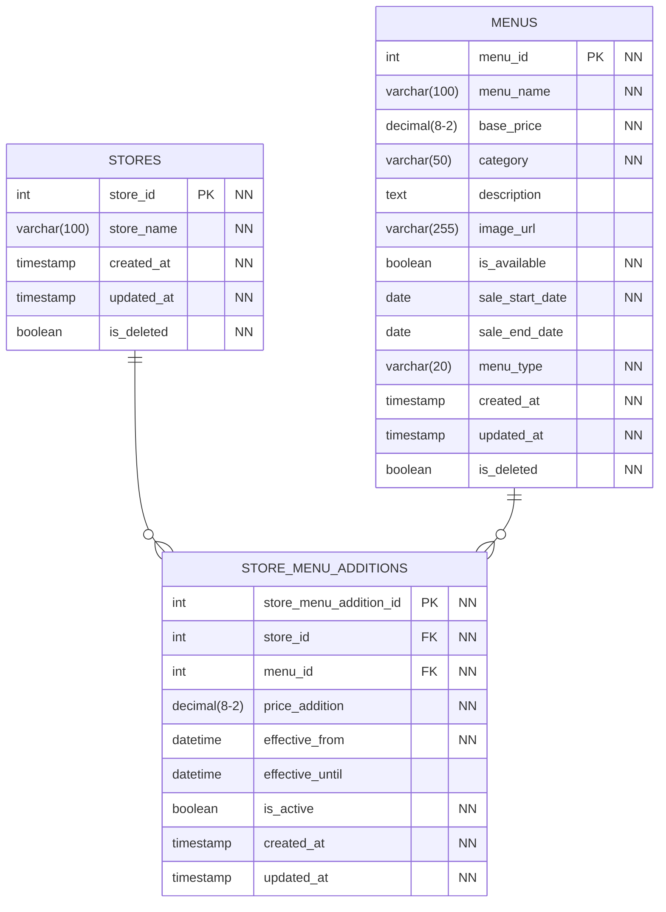

# 店舗別価格設定の分析と改善案

## 現在の設計の問題点

### 統一価格の課題

現在の MENUS テーブルでは、すべての店舗で同じ価格が設定されています：

```sql
MENUS テーブル（現在）
- menu_id: 1, menu_name: "ビッグマック", price: 390
- menu_id: 2, menu_name: "ポテトM", price: 280
```

### 現実の価格設定

実際のマクドナルドでは立地によって価格が異なります：

```md
例：ビッグマック

- 一般店舗: 390 円
- 空港店: 450 円
- 高速道路 SA: 420 円
- 都心駅構内: 410 円
```

### 問題点

1. **立地による価格差の未対応**

   - 空港、高速道路、駅構内などの高コスト立地
   - 地域による人件費・賃料の違い

2. **動的価格設定の未対応**

   - 時間帯による価格変動
   - キャンペーン期間中の特別価格

3. **店舗別在庫・販売管理の困難**
   - 売上計算の複雑化
   - 収益分析の困難

## 改善案 1: 加算方式による店舗別価格設定

### 新しいテーブル構造



### 具体的な実装例

**MENUS テーブル（基準価格と販売期間）**

```sql
INSERT INTO MENUS (menu_id, menu_name, base_price, category, sale_start_date, sale_end_date, menu_type) VALUES
-- レギュラーメニュー（終了日なし）
(1, 'ビッグマック', 390, 'バーガー', '2020-01-01', NULL, 'regular'),
(2, 'ポテト M', 280, 'サイド', '2020-01-01', NULL, 'regular'),
(3, 'コーラ M', 150, 'ドリンク', '2020-01-01', NULL, 'regular'),

-- 期間限定メニュー
(4, '月見バーガー', 420, 'バーガー', '2024-09-01', '2024-10-31', 'limited'),
(5, 'チキンタツタ', 380, 'バーガー', '2024-03-01', '2024-04-30', 'limited'),
(6, 'シャカシャカポテト明太子', 320, 'サイド', '2024-07-01', '2024-08-31', 'limited'),

-- 朝マックメニュー（時間制限あり）
(7, 'エッグマフィン', 250, 'バーガー', '2020-01-01', NULL, 'breakfast'),
(8, 'ホットケーキ', 320, 'スイーツ', '2020-01-01', NULL, 'breakfast'),

-- 季節限定メニュー
(9, 'アイスコーヒーS', 120, 'ドリンク', '2024-04-01', '2024-09-30', 'seasonal'),
(10, 'ホットコーヒーS', 120, 'ドリンク', '2024-10-01', '2024-03-31', 'seasonal');
```

**STORES テーブル（基本情報のみ）**

```sql
INSERT INTO STORES (store_id, store_name) VALUES
(1, '新宿店'),
(2, '羽田空港店'),
(3, '海老名SA店'),
(4, '品川駅店');
```

**STORE_MENU_ADDITIONS テーブル（商品別個別加算額）**

```sql
-- 店舗×商品の組み合わせで個別に加算額を設定
INSERT INTO STORE_MENU_ADDITIONS VALUES
-- 新宿店（基準価格のまま、加算額0円）レギュラーメニュー
(1, 1, 1, 0, '2024-01-01', NULL, true, NOW(), NOW()),   -- ビッグマック +0円
(2, 1, 2, 0, '2024-01-01', NULL, true, NOW(), NOW()),   -- ポテト +0円
(3, 1, 3, 0, '2024-01-01', NULL, true, NOW(), NOW()),   -- コーラ +0円

-- 新宿店 期間限定メニュー
(13, 1, 4, 0, '2024-09-01', '2024-10-31', true, NOW(), NOW()),  -- 月見バーガー +0円
(14, 1, 5, 0, '2024-03-01', '2024-04-30', true, NOW(), NOW()),  -- チキンタツタ +0円

-- 羽田空港店 レギュラーメニュー
(4, 2, 1, 60, '2024-01-01', NULL, true, NOW(), NOW()),  -- ビッグマック +60円
(5, 2, 2, 40, '2024-01-01', NULL, true, NOW(), NOW()),  -- ポテト +40円
(6, 2, 3, 30, '2024-01-01', NULL, true, NOW(), NOW()),  -- コーラ +30円

-- 羽田空港店 期間限定メニュー
(15, 2, 4, 80, '2024-09-01', '2024-10-31', true, NOW(), NOW()), -- 月見バーガー +80円
(16, 2, 5, 70, '2024-03-01', '2024-04-30', true, NOW(), NOW()), -- チキンタツタ +70円

-- 海老名SA店 レギュラーメニュー
(7, 3, 1, 30, '2024-01-01', NULL, true, NOW(), NOW()),  -- ビッグマック +30円
(8, 3, 2, 20, '2024-01-01', NULL, true, NOW(), NOW()),  -- ポテト +20円
(9, 3, 3, 10, '2024-01-01', NULL, true, NOW(), NOW()),  -- コーラ +10円

-- 海老名SA店 期間限定メニュー
(17, 3, 4, 50, '2024-09-01', '2024-10-31', true, NOW(), NOW()), -- 月見バーガー +50円

-- 品川駅店 レギュラーメニュー
(10, 4, 1, 20, '2024-01-01', NULL, true, NOW(), NOW()), -- ビッグマック +20円
(11, 4, 2, 10, '2024-01-01', NULL, true, NOW(), NOW()), -- ポテト +10円
(12, 4, 3, 20, '2024-01-01', NULL, true, NOW(), NOW()); -- コーラ +20円
```

**価格計算の結果**

```
店舗ID | 店舗名        | ビッグマック        | ポテトM            | コーラM
1      | 新宿店        | 390円(390+0)       | 280円(280+0)       | 150円(150+0)
2      | 羽田空港店    | 450円(390+60)      | 320円(280+40)      | 180円(150+30)
3      | 海老名SA店    | 420円(390+30)      | 300円(280+20)      | 160円(150+10)
4      | 品川駅店      | 410円(390+20)      | 290円(280+10)      | 170円(150+20)
```

**重要な設計ポイント**

- **基準価格管理**: 全商品の基準価格を MENUS テーブルで一元管理
- **商品別個別加算**: 店舗 × 商品の組み合わせで加算額を個別設定
- **価格計算式**: 最終価格 = 基準価格 + 商品別加算額
- **全組み合わせ管理**: 全店舗 × 全商品で加算額を明示的に設定
- **期間限定対応**: 販売期間とメニュー種別による自動表示制御
- **店舗別期間限定価格**: 期間限定メニューも店舗別価格設定が可能

## 改善案 2: 加算方式価格計算ロジック

### 価格計算ロジック

```sql
-- 価格計算方式
最終価格 = MENUS.base_price + STORE_MENU_ADDITIONS.price_addition

-- 全店舗×全商品の組み合わせで加算額を必須設定
-- 基準価格と同じ場合は加算額0円を明示的に設定
```

### 価格取得の SQL 例

```sql
-- 指定店舗の販売中メニュー価格を計算して取得
SELECT
    m.menu_id,
    m.menu_name,
    m.base_price,
    m.menu_type,
    m.sale_start_date,
    m.sale_end_date,
    sma.price_addition,
    m.base_price + sma.price_addition AS final_price
FROM MENUS m
INNER JOIN STORE_MENU_ADDITIONS sma ON m.menu_id = sma.menu_id
WHERE sma.store_id = ?
  AND sma.is_active = true
  AND sma.effective_from <= NOW()
  AND (sma.effective_until IS NULL OR sma.effective_until > NOW())
  AND m.is_deleted = false
  AND m.is_available = true
  AND m.sale_start_date <= CURDATE()
  AND (m.sale_end_date IS NULL OR m.sale_end_date >= CURDATE())
ORDER BY m.menu_type, m.menu_name;
```

### データ管理の簡素化

```sql
-- 新店舗開店時: 全メニューの加算額を設定
INSERT INTO STORES (store_name) VALUES ('新規店舗');

-- 新規店舗の全商品加算額を設定（例：基準価格+10円）
INSERT INTO STORE_MENU_ADDITIONS (store_id, menu_id, price_addition, effective_from, is_active)
SELECT
    新店舗ID,
    menu_id,
    10,  -- 一律+10円、または商品ごとに個別設定
    NOW(),
    true
FROM MENUS WHERE is_deleted = false;

-- 新メニュー追加時: 販売期間と全店舗の加算額を設定
INSERT INTO MENUS (menu_name, base_price, category, sale_start_date, sale_end_date, menu_type) VALUES
('新商品', 350, 'バーガー', '2024-12-01', '2024-12-31', 'limited');

INSERT INTO STORE_MENU_ADDITIONS (store_id, menu_id, price_addition, effective_from, is_active)
SELECT
    store_id,
    新商品ID,
    CASE store_id
        WHEN 1 THEN 0   -- 新宿店: +0円
        WHEN 2 THEN 60  -- 羽田空港店: +60円
        WHEN 3 THEN 30  -- 海老名SA店: +30円
        WHEN 4 THEN 20  -- 品川駅店: +20円
    END,
    NOW(),
    true
FROM STORES WHERE is_deleted = false;

-- 期間限定メニューの自動終了処理
UPDATE MENUS
SET is_available = false, updated_at = NOW()
WHERE sale_end_date < CURDATE()
  AND menu_type IN ('limited', 'seasonal')
  AND is_available = true;

-- 期間限定メニューの店舗別価格設定例
INSERT INTO STORE_MENU_ADDITIONS (store_id, menu_id, price_addition, effective_from, effective_until, is_active)
SELECT
    store_id,
    4,  -- 月見バーガー
    CASE store_id
        WHEN 1 THEN 0   -- 新宿店: +0円
        WHEN 2 THEN 80  -- 羽田空港店: +80円（期間限定は高め設定）
        WHEN 3 THEN 50  -- 海老名SA店: +50円
        WHEN 4 THEN 30  -- 品川駅店: +30円
    END,
    '2024-09-01',       -- 販売開始日
    '2024-10-31',       -- 販売終了日
    true
FROM STORES WHERE is_deleted = false;
```

## 改善案 3: 期間限定メニューの運用管理

### メニュー種別による管理

**メニュー種別の分類**

- `regular`: レギュラーメニュー（常時販売）
- `limited`: 期間限定メニュー（特定期間のみ）
- `seasonal`: 季節限定メニュー（毎年同時期に販売）
- `breakfast`: 朝マックメニュー（時間制限あり）
- `campaign`: キャンペーンメニュー（特別価格設定）

### 期間限定メニューの価格戦略

```sql
-- 期間限定メニューの価格設定パターン

-- パターン1: 通常より高い価格設定（プレミアム戦略）
INSERT INTO MENUS VALUES (11, 'プレミアムバーガー', 580, 'バーガー', '2024-12-01', '2024-12-31', 'limited');

-- パターン2: 試食促進のための低価格設定
INSERT INTO MENUS VALUES (12, 'お試しチキン', 200, 'バーガー', '2024-12-01', '2024-12-15', 'campaign');

-- パターン3: 季節商品の価格設定
INSERT INTO MENUS VALUES (13, '冬限定ホットドリンク', 180, 'ドリンク', '2024-12-01', '2025-02-28', 'seasonal');
```

### 期間限定メニューの自動管理

```sql
-- 日次バッチ処理：期間終了メニューの自動無効化
CREATE EVENT daily_menu_cleanup
ON SCHEDULE EVERY 1 DAY
STARTS '2024-01-01 02:00:00'
DO
BEGIN
    -- 販売期間終了メニューを無効化
    UPDATE MENUS
    SET is_available = false, updated_at = NOW()
    WHERE sale_end_date < CURDATE()
      AND menu_type IN ('limited', 'seasonal', 'campaign')
      AND is_available = true;

    -- 対応する価格設定も無効化
    UPDATE STORE_MENU_ADDITIONS
    SET is_active = false, updated_at = NOW()
    WHERE effective_until < CURDATE()
      AND is_active = true;

    -- 季節メニューの自動復活（来年同時期）
    UPDATE MENUS
    SET is_available = true,
        sale_start_date = DATE_ADD(sale_start_date, INTERVAL 1 YEAR),
        sale_end_date = DATE_ADD(sale_end_date, INTERVAL 1 YEAR),
        updated_at = NOW()
    WHERE menu_type = 'seasonal'
      AND MONTH(sale_start_date) = MONTH(CURDATE())
      AND DAY(sale_start_date) = DAY(CURDATE())
      AND is_available = false;
END;
```

### 期間限定メニュー表示の SQL

```sql
-- アプリ表示用：現在販売中の期間限定メニューを取得
SELECT
    m.menu_id,
    m.menu_name,
    m.menu_type,
    m.sale_start_date,
    m.sale_end_date,
    DATEDIFF(m.sale_end_date, CURDATE()) AS days_remaining,
    m.base_price + sma.price_addition AS final_price,
    CASE
        WHEN m.menu_type = 'limited' THEN '期間限定'
        WHEN m.menu_type = 'seasonal' THEN '季節限定'
        WHEN m.menu_type = 'campaign' THEN 'キャンペーン'
        ELSE ''
    END AS menu_label
FROM MENUS m
INNER JOIN STORE_MENU_ADDITIONS sma ON m.menu_id = sma.menu_id
WHERE sma.store_id = ?
  AND m.menu_type IN ('limited', 'seasonal', 'campaign')
  AND m.is_available = true
  AND m.sale_start_date <= CURDATE()
  AND (m.sale_end_date IS NULL OR m.sale_end_date >= CURDATE())
  AND sma.is_active = true
  AND sma.effective_from <= NOW()
  AND (sma.effective_until IS NULL OR sma.effective_until > NOW())
ORDER BY
    CASE m.menu_type
        WHEN 'campaign' THEN 1
        WHEN 'limited' THEN 2
        WHEN 'seasonal' THEN 3
    END,
    days_remaining ASC;
```

## 改善案 4: 時間帯別価格対応

### 動的価格設定テーブル

```sql
CREATE TABLE TIME_BASED_PRICING (
    time_pricing_id INT PRIMARY KEY,
    store_id INT NOT NULL,
    menu_id INT NOT NULL,
    day_of_week VARCHAR(10) NOT NULL, -- 'weekday', 'weekend', 'holiday'
    start_time TIME NOT NULL,
    end_time TIME NOT NULL,
    price_adjustment DECIMAL(8,2) NOT NULL, -- 価格調整額
    adjustment_type VARCHAR(10) NOT NULL,   -- 'amount', 'percentage'
    effective_from DATE NOT NULL,
    effective_until DATE,
    is_active BOOLEAN NOT NULL DEFAULT true
);

-- 朝マック時間帯の特別価格例
INSERT INTO TIME_BASED_PRICING VALUES
(1, 1, 1, 'weekday', '05:00', '10:30', -50, 'amount', '2024-01-01', NULL, true);
```

## ORDER_DETAILS テーブルの拡張

### 注文時価格の記録

```sql
ALTER TABLE ORDER_DETAILS ADD COLUMN unit_price_at_order DECIMAL(8,2) NOT NULL;
ALTER TABLE ORDER_DETAILS ADD COLUMN standard_price DECIMAL(8,2) NOT NULL;
ALTER TABLE ORDER_DETAILS ADD COLUMN price_adjustment DECIMAL(8,2) DEFAULT 0;
ALTER TABLE ORDER_DETAILS ADD COLUMN adjustment_reason VARCHAR(100);

-- 注文時の価格記録例
INSERT INTO ORDER_DETAILS VALUES (
    order_detail_id,
    order_id,
    menu_id,
    quantity,
    450,  -- unit_price_at_order（注文時の実際価格）
    390,  -- standard_price（標準価格）
    60,   -- price_adjustment（調整額）
    '空港店舗価格', -- adjustment_reason
    total_price,
    customizations
);
```

## 管理画面での対応

### 価格管理機能

1. 標準価格管理

   - 全国統一の基準価格設定
   - 一括価格変更機能

2. **店舗別価格管理**

   - 店舗種別による一括設定
   - 個別店舗での価格オーバーライド
   - 期間限定価格の設定

3. **価格履歴管理**
   - 価格変更履歴の追跡
   - 売上への影響分析

### 価格管理機能

```sql
-- 基準価格の変更（全店舗に自動反映）
UPDATE MENUS SET base_price = 400 WHERE menu_id = 1;

-- 特定店舗×商品の加算額変更
UPDATE STORE_MENU_ADDITIONS
SET price_addition = 70, updated_at = NOW()
WHERE store_id = 2 AND menu_id = 1;  -- 羽田空港店のビッグマック

-- 特定店舗の全商品加算額を一括変更
UPDATE STORE_MENU_ADDITIONS
SET price_addition = price_addition + 10, updated_at = NOW()
WHERE store_id = 2;  -- 羽田空港店の全商品に+10円追加

-- 価格シミュレーション（実際の変更前に確認）
SELECT
    s.store_name,
    m.menu_name,
    m.base_price AS current_base,
    400 AS new_base,  -- 新しい基準価格
    sma.price_addition,
    400 + sma.price_addition AS new_final_price
FROM MENUS m
INNER JOIN STORE_MENU_ADDITIONS sma ON m.menu_id = sma.menu_id
INNER JOIN STORES s ON sma.store_id = s.store_id
WHERE m.menu_id = 1;  -- ビッグマックの価格変更影響を確認
```

## アプリケーション側の対応

### 価格表示ロジック

```javascript
// 店舗選択時の価格取得
async function getMenuPrices(storeId) {
  const response = await fetch(`/api/stores/${storeId}/menu-prices`);
  const menuPrices = await response.json();

  // 価格表示の更新
  menuPrices.forEach((menu) => {
    updateMenuPrice(menu.menu_id, menu.final_price, menu.adjustment_reason);
  });
}

// 価格変更の通知
function updateMenuPrice(menuId, newPrice, reason) {
  const priceElement = document.querySelector(
    `[data-menu-id="${menuId}"] .price`
  );
  priceElement.textContent = `¥${newPrice}`;

  if (reason) {
    priceElement.setAttribute("title", reason);
    priceElement.classList.add("price-adjusted");
  }
}
```

この設計により、店舗の立地特性に応じた柔軟な価格設定が可能になり、実際のマクドナルドの運用により近いシステムが構築できます。
