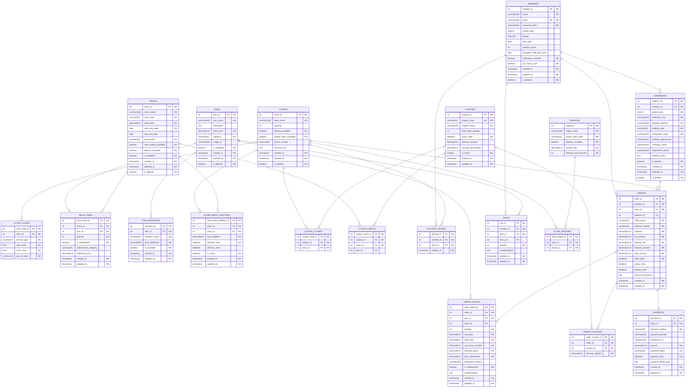

# 物理 ER 図

```mermaid
erDiagram
    MEMBERS {
        int member_id PK "NN"
        varchar(100) name "NN"
        varchar(100) email UK "NN"
        varchar(255) password_hash "NN"
        char(7) postal_code
        char(20) gender
        date birth_date
        int children_count
        date youngest_child_birth_date
        boolean notification_enabled "NN"
        boolean two_factor_auth "NN"
        timestamp created_at "NN"
        timestamp updated_at "NN"
        boolean is_deleted "NN"
    }

    STORES {
        int store_id PK "NN"
        varchar(100) store_name "NN"
        int capacity
        boolean parking_available "NN"
        boolean mobile_order_available "NN"
        varchar(20) phone_number
        text services_json
        timestamp created_at "NN"
        timestamp updated_at "NN"
        boolean is_deleted "NN"
    }

    STORE_HOURS {
        int store_hour_id PK "NN"
        int store_id FK "NN"
        varchar(20) service_type "NN"
        time open_time "NN"
        time close_time "NN"
        varchar(10) day_of_week "NN"
    }

    ADDRESSES {
        int address_id PK "NN"
        int member_id FK "NN"
        char(7) postal_code "NN"
        varchar(100) prefecture_city "NN"
        varchar(200) detailed_address "NN"
        varchar(50) building_type "NN"
        varchar(100) nameplate_name "NN"
        varchar(200) building_appearance
        varchar(100) company_name
        varchar(100) department_name
        text delivery_notes
        boolean is_default "NN"
        timestamp created_at "NN"
        timestamp updated_at "NN"
        boolean is_deleted "NN"
    }

    ITEMS {
        int item_id PK "NN"
        varchar(100) item_name "NN"
        text description
        decimal(8-2) base_price "NN"
        varchar(50) category "NN"
        varchar(255) image_url
        boolean is_available "NN"
        timestamp created_at "NN"
        timestamp updated_at "NN"
        boolean is_deleted "NN"
    }

    MENUS {
        int menu_id PK "NN"
        varchar(100) menu_name "NN"
        varchar(20) menu_type "NN"
        decimal(8-2) base_price "NN"
        date sale_start_date "NN"
        date sale_end_date
        varchar(20) time_period "NN"
        boolean store_pickup_available "NN"
        boolean delivery_available "NN"
        boolean is_available "NN"
        timestamp created_at "NN"
        timestamp updated_at "NN"
        boolean is_deleted "NN"
    }

    MENU_ITEMS {
        int menu_item_id PK "NN"
        int menu_id FK "NN"
        int item_id FK "NN"
        int quantity "NN"
        boolean is_replaceable "NN"
        varchar(50) replacement_category
        decimal(8-2) additional_price
        timestamp created_at "NN"
        timestamp updated_at "NN"
    }

    ITEM_VARIATIONS {
        int variation_id PK "NN"
        int item_id FK "NN"
        varchar(50) variation_name "NN"
        decimal(8-2) price_difference "NN"
        boolean is_available "NN"
        timestamp created_at "NN"
        timestamp updated_at "NN"
    }

    STORE_MENU_ADDITIONS {
        int store_menu_addition_id PK "NN"
        int store_id FK "NN"
        int menu_id FK "NN"
        decimal(8-2) price_addition "NN"
        datetime effective_from "NN"
        datetime effective_until
        boolean is_active "NN"
        timestamp created_at "NN"
        timestamp updated_at "NN"
    }

    COUPONS {
        int coupon_id PK "NN"
        varchar(50) coupon_code UK "NN"
        varchar(100) coupon_name "NN"
        int max_order_quantity
        datetime expiry_date "NN"
        decimal(8-2) discount_amount
        decimal(5-2) discount_percentage
        boolean is_active "NN"
        timestamp created_at "NN"
        timestamp updated_at "NN"
    }

    COUPON_STORES {
        int coupon_store_id PK "NN"
        int coupon_id FK "NN"
        int store_id FK "NN"
    }

    COUPON_MENUS {
        int coupon_menu_id PK "NN"
        int coupon_id FK "NN"
        int menu_id FK "NN"
        int item_id FK
    }

    FAVORITE_STORES {
        int favorite_id PK "NN"
        int member_id FK "NN"
        int store_id FK "NN"
        timestamp created_at "NN"
    }

    ORDERS {
        int order_id PK "NN"
        int member_id FK "NN"
        int store_id FK "NN"
        int address_id FK
        varchar(20) order_status "NN"
        varchar(20) delivery_method "NN"
        decimal(10-2) subtotal "NN"
        decimal(10-2) tax_amount "NN"
        decimal(10-2) delivery_fee "NN"
        decimal(10-2) discount_amount "NN"
        decimal(10-2) total_amount "NN"
        datetime order_date "NN"
        datetime pickup_time
        datetime delivery_time
        text special_instructions
        timestamp created_at "NN"
        timestamp updated_at "NN"
    }

    ORDER_DETAILS {
        int order_detail_id PK "NN"
        int order_id FK "NN"
        int item_id FK "NN"
        int menu_id FK
        int quantity "NN"
        decimal(8-2) unit_price "NN"
        decimal(8-2) total_price "NN"
        decimal(8-2) unit_price_at_order "NN"
        decimal(8-2) standard_price "NN"
        decimal(8-2) price_adjustment "NN"
        varchar(100) adjustment_reason
        boolean is_replacement "NN"
        text customizations
        timestamp created_at "NN"
        timestamp updated_at "NN"
    }

    ORDER_COUPONS {
        int order_coupon_id PK "NN"
        int order_id FK "NN"
        int coupon_id FK "NN"
        decimal(8-2) discount_applied "NN"
    }

    CARTS {
        int cart_id PK "NN"
        int member_id FK "NN"
        int item_id FK "NN"
        int menu_id FK
        int quantity "NN"
        text customizations
        timestamp created_at "NN"
        timestamp updated_at "NN"
    }

    PAYMENTS {
        int payment_id PK "NN"
        int order_id FK "NN"
        varchar(50) payment_method "NN"
        varchar(100) payment_provider
        varchar(100) transaction_id
        decimal(10-2) amount "NN"
        varchar(20) payment_status "NN"
        datetime payment_date "NN"
        text payment_details_json
        timestamp created_at "NN"
        timestamp updated_at "NN"
    }

    REGIONS {
        int region_id PK "NN"
        varchar(100) region_name "NN"
        varchar(10) postal_code_prefix "NN"
        boolean delivery_available "NN"
        decimal(8-2) delivery_fee "NN"
        int delivery_time_minutes "NN"
    }

    STORE_REGIONS {
        int store_region_id PK "NN"
        int store_id FK "NN"
        int region_id FK "NN"
    }

    %% Relationships (外部キーに基づく)
    MEMBERS ||--o{ ADDRESSES : ""
    MEMBERS ||--o{ FAVORITE_STORES : ""
    MEMBERS ||--o{ ORDERS : ""
    MEMBERS ||--o{ CARTS : ""

    STORES ||--o{ STORE_HOURS : ""
    STORES ||--o{ FAVORITE_STORES : ""
    STORES ||--o{ ORDERS : ""
    STORES ||--o{ COUPON_STORES : ""
    STORES ||--o{ STORE_REGIONS : ""
    STORES ||--o{ STORE_MENU_ADDITIONS : ""

    ITEMS ||--o{ MENU_ITEMS : ""
    ITEMS ||--o{ ITEM_VARIATIONS : ""
    ITEMS ||--o{ ORDER_DETAILS : ""
    ITEMS ||--o{ CARTS : ""

    MENUS ||--o{ MENU_ITEMS : ""
    MENUS ||--o{ COUPON_MENUS : ""
    MENUS ||--o{ STORE_MENU_ADDITIONS : ""

    COUPONS ||--o{ COUPON_STORES : ""
    COUPONS ||--o{ COUPON_MENUS : ""
    COUPONS ||--o{ ORDER_COUPONS : ""

    ORDERS ||--o{ ORDER_DETAILS : ""
    ORDERS ||--o{ ORDER_COUPONS : ""
    ORDERS ||--|| PAYMENTS : ""
    ADDRESSES ||--o{ ORDERS : ""

    REGIONS ||--o{ STORE_REGIONS : ""
```
