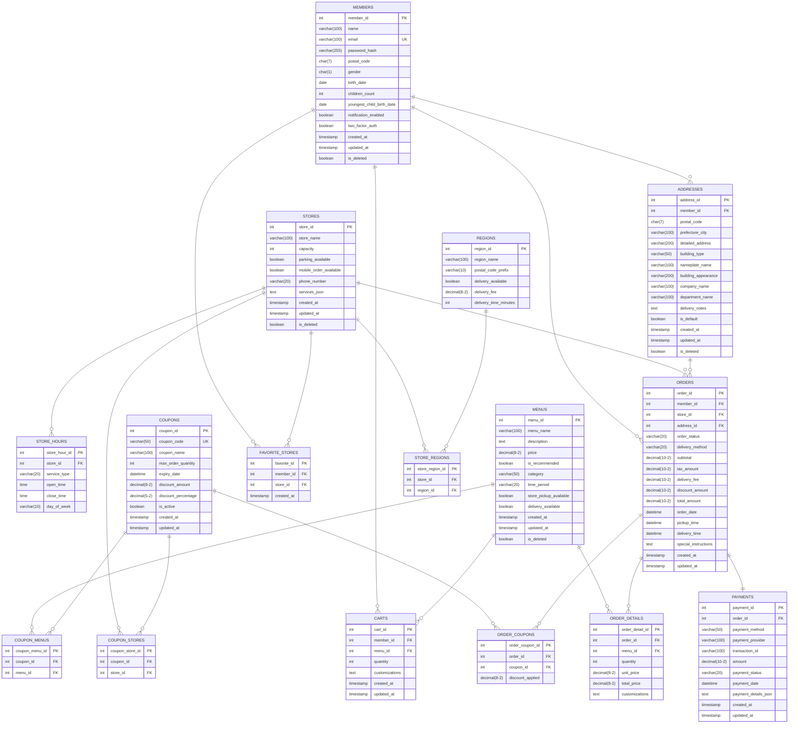

# 物理 ER 図

```mermaid
erDiagram
    MEMBERS {
        int member_id PK
        varchar(100) name
        varchar(100) email UK
        varchar(255) password_hash
        char(7) postal_code
        char(1) gender
        date birth_date
        int children_count
        date youngest_child_birth_date
        boolean notification_enabled
        boolean two_factor_auth
        timestamp created_at
        timestamp updated_at
        boolean is_deleted
    }

    STORES {
        int store_id PK
        varchar(100) store_name
        int capacity
        boolean parking_available
        boolean mobile_order_available
        varchar(20) phone_number
        text services_json
        timestamp created_at
        timestamp updated_at
        boolean is_deleted
    }

    STORE_HOURS {
        int store_hour_id PK
        int store_id FK
        varchar(20) service_type
        time open_time
        time close_time
        varchar(10) day_of_week
    }

    ADDRESSES {
        int address_id PK
        int member_id FK
        char(7) postal_code
        varchar(100) prefecture_city
        varchar(200) detailed_address
        varchar(50) building_type
        varchar(100) nameplate_name
        varchar(200) building_appearance
        varchar(100) company_name
        varchar(100) department_name
        text delivery_notes
        boolean is_default
        timestamp created_at
        timestamp updated_at
        boolean is_deleted
    }

    MENUS {
        int menu_id PK
        varchar(100) menu_name
        text description
        decimal(8-2) price
        boolean is_recommended
        varchar(50) category
        varchar(20) time_period
        boolean store_pickup_available
        boolean delivery_available
        timestamp created_at
        timestamp updated_at
        boolean is_deleted
    }


    COUPONS {
        int coupon_id PK
        varchar(50) coupon_code UK
        varchar(100) coupon_name
        int max_order_quantity
        datetime expiry_date
        decimal(8-2) discount_amount
        decimal(5-2) discount_percentage
        boolean is_active
        timestamp created_at
        timestamp updated_at
    }

    COUPON_STORES {
        int coupon_store_id PK
        int coupon_id FK
        int store_id FK
    }

    COUPON_MENUS {
        int coupon_menu_id PK
        int coupon_id FK
        int menu_id FK
    }

    FAVORITE_STORES {
        int favorite_id PK
        int member_id FK
        int store_id FK
        timestamp created_at
    }

    ORDERS {
        int order_id PK
        int member_id FK
        int store_id FK
        int address_id FK
        varchar(20) order_status
        varchar(20) delivery_method
        decimal(10-2) subtotal
        decimal(10-2) tax_amount
        decimal(10-2) delivery_fee
        decimal(10-2) discount_amount
        decimal(10-2) total_amount
        datetime order_date
        datetime pickup_time
        datetime delivery_time
        text special_instructions
        timestamp created_at
        timestamp updated_at
    }

    ORDER_DETAILS {
        int order_detail_id PK
        int order_id FK
        int menu_id FK
        int quantity
        decimal(8-2) unit_price
        decimal(8-2) total_price
        text customizations
    }

    ORDER_COUPONS {
        int order_coupon_id PK
        int order_id FK
        int coupon_id FK
        decimal(8-2) discount_applied
    }

    CARTS {
        int cart_id PK
        int member_id FK
        int menu_id FK
        int quantity
        text customizations
        timestamp created_at
        timestamp updated_at
    }

    PAYMENTS {
        int payment_id PK
        int order_id FK
        varchar(50) payment_method
        varchar(100) payment_provider
        varchar(100) transaction_id
        decimal(10-2) amount
        varchar(20) payment_status
        datetime payment_date
        text payment_details_json
        timestamp created_at
        timestamp updated_at
    }

    REGIONS {
        int region_id PK
        varchar(100) region_name
        varchar(10) postal_code_prefix
        boolean delivery_available
        decimal(8-2) delivery_fee
        int delivery_time_minutes
    }

    STORE_REGIONS {
        int store_region_id PK
        int store_id FK
        int region_id FK
    }

    %% Relationships (外部キーに基づく)
    MEMBERS ||--o{ ADDRESSES : ""
    MEMBERS ||--o{ FAVORITE_STORES : ""
    MEMBERS ||--o{ ORDERS : ""
    MEMBERS ||--o{ CARTS : ""

    STORES ||--o{ STORE_HOURS : ""
    STORES ||--o{ FAVORITE_STORES : ""
    STORES ||--o{ ORDERS : ""
    STORES ||--o{ COUPON_STORES : ""
    STORES ||--o{ STORE_REGIONS : ""

    MENUS ||--o{ ORDER_DETAILS : ""
    MENUS ||--o{ CARTS : ""
    MENUS ||--o{ COUPON_MENUS : ""

    COUPONS ||--o{ COUPON_STORES : ""
    COUPONS ||--o{ COUPON_MENUS : ""
    COUPONS ||--o{ ORDER_COUPONS : ""

    ORDERS ||--o{ ORDER_DETAILS : ""
    ORDERS ||--o{ ORDER_COUPONS : ""
    ORDERS ||--|| PAYMENTS : ""
    ADDRESSES ||--o{ ORDERS : ""

    REGIONS ||--o{ STORE_REGIONS : ""
```
